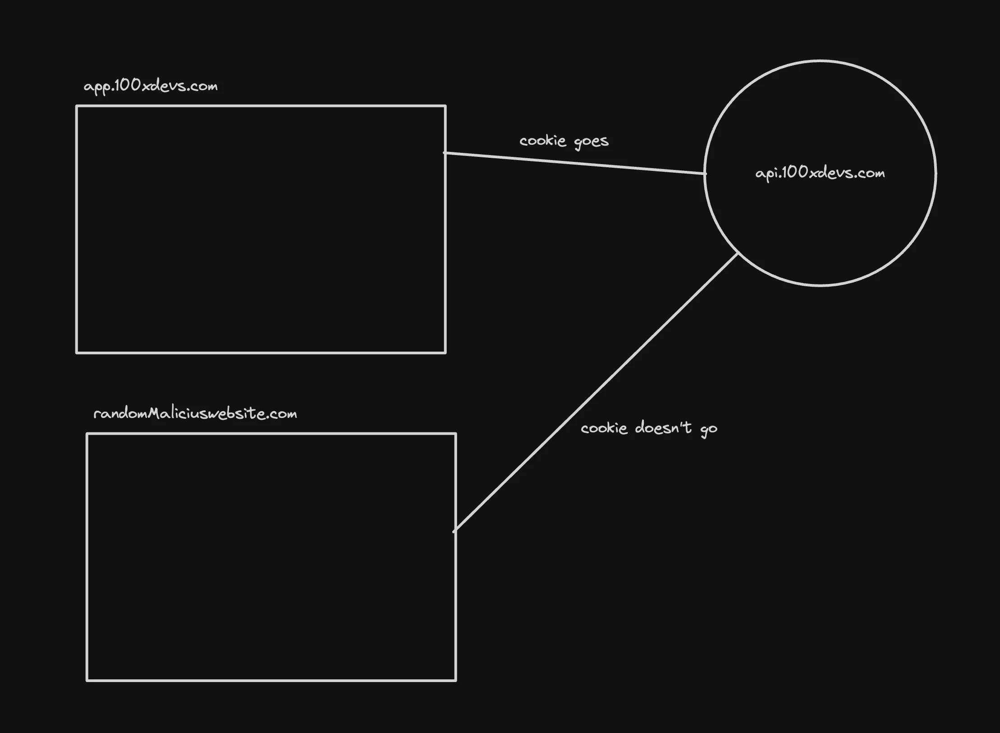
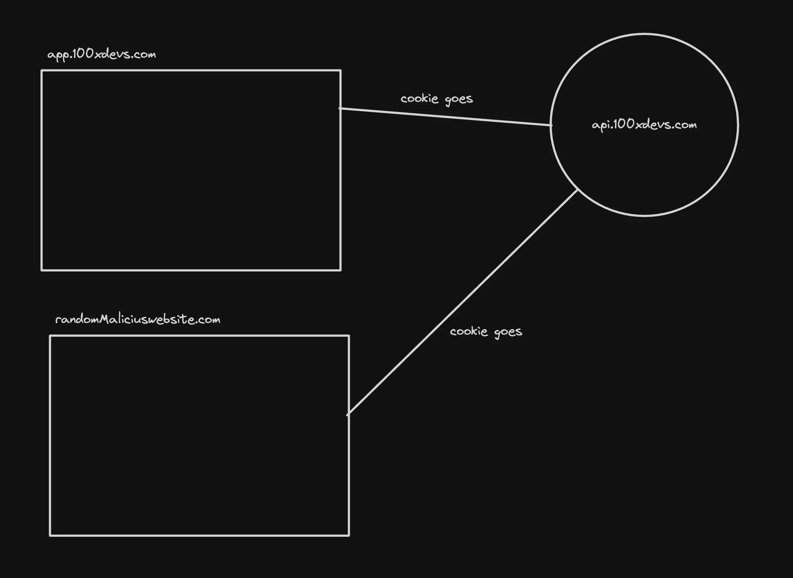

# Cookies 

Cookies can have an expiry attached to them
Cookies can be be restricted to only https and to certain domains

## types
1. Session 
Temporary cookies that expire when the user closes the browser.
Used for maintaining sessions, such as login states.

2. Persistant 
Stored on the user’s device for a specified period.
Used for remembering user preferences, login details, etc.

3. Secure 
Sent only over HTTPS connections for security purposes.
Prevents cookie theft in Man-in-the-Middle (MITM) attacks.

## Properties of cookies
1. HttpOnly - Can not be accessed by client side scripts
2. SameSite - Ensures cookies are not send on cross origin requests
a. Strict

b. Lax - Only GET requests and on top level navigation

c. None

3. Domains - You can also specify what all domains should the cookie be sent from

## CSRF attacks
Cross site request forgery attacks were super common because of cookies and hence the SameSite attribute was introduced

## imps
- import cookieParser from "cookie-parser";
- app.use(cors({
    credentials: true,
    origin: "http://localhost:5173"
}));
- res.cookie("authToken", token);
- const token = req.cookies.authToken;
-       withCredentials: true,
with every request

## if frontend is serving on same endpoint 
then we dont need cors as weel as credintials . 